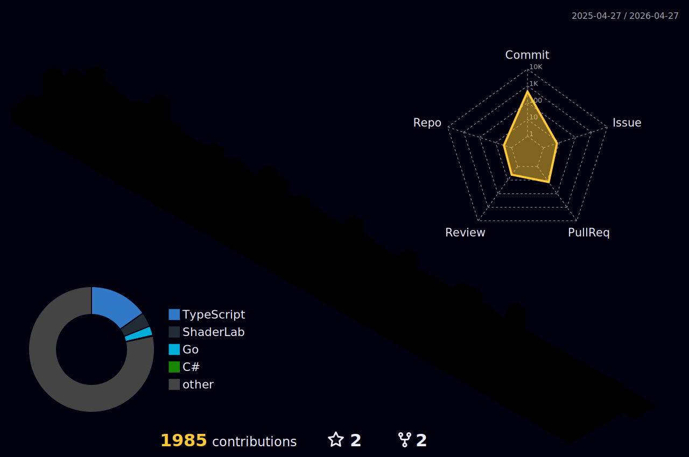

## Hi there 👋

I am passionate about the software development process, mathematics and especially game development. I focus on creating innovative mechanics, optimizing performance and delivering immersive experiences that push boundaries.

<!--
**MtMath/MtMath** is a ✨ _special_ ✨ repository because its `README.md` (this file) appears on your GitHub profile.

Here are some ideas to get you started:

-  ...
- 🌱 I’m currently learning ...
- 👯 I’m looking to collaborate on ...
- 🤔 I’m looking for help with ...
- 💬 Ask me about ...
- 😄 Pronouns: ...
- ⚡ Fun fact: ...
-->

|  |  |  
 | ----------- | ----------- |

  

##

     

  
